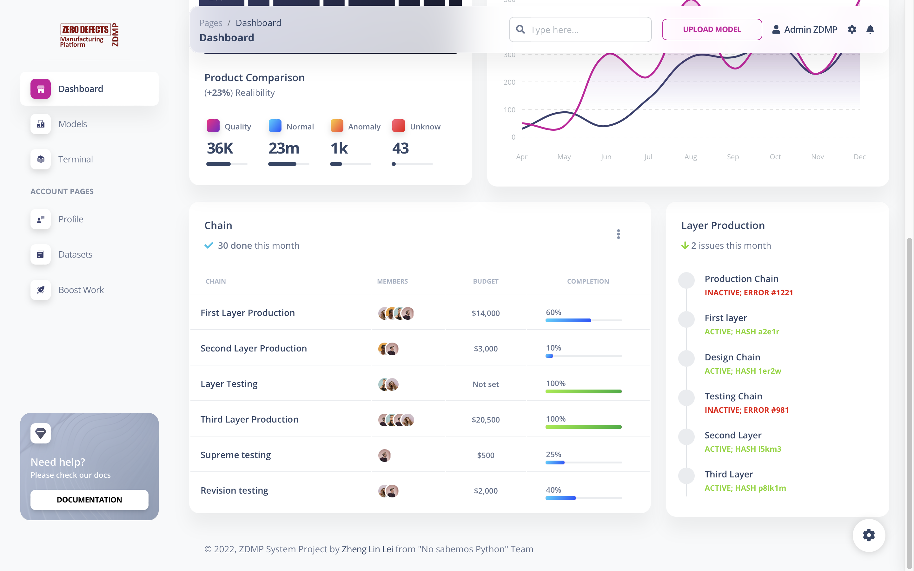

# ZDMP Client Server Datasets

[](https://github.com/ZhengLinLei/ZDMP-client/releases)
[](https://github.com/ZhengLinLei/ZDMP-client/issues)
[](https://github.com/ZhengLinLei/ZDMP-client/fork)





Client server repository for [ZDMP](https://github.com/ZhengLinLei/ZDMP) project.

## Installation
Clone the repository into the server machine
```bash
git clone https://github.com/ZhengLinLei/ZDMP-client.git
```

Install the [node](https://nodejs.org) server, run the following commands:
```bash
npm install
```

## Usage
Run the following command to start the server:
```bash
npm run start
```

And acces to the server at [http://localhost:3000](http://localhost:3000) or [http://localhost](http://localhost)

If you are debugging the project you can run the following command to start the server in debug mode:
```bash
npm run start-n
```

## Contributing
Pull requests are welcome. For major changes, please open an issue first to discuss what you would like to change.

Please make sure to update tests as appropriate.

### How to contribute
1. Fork the project
2. Create your feature branch (git checkout -b feature/AmazingFeature)
3. Commit your changes (git commit -m 'Add some AmazingFeature')
4. Push to the branch (git push origin feature/AmazingFeature)
5. Open a pull request


## Authors and acknowledgment
* [Zheng Lin Lei](https://github.com/ZhengLinLei)
* [ITI](https://iti.es)
* [ZDMP](https://zdmp.eu)


## License
License: [Apache License 2.0](http://www.apache.org/licenses/)